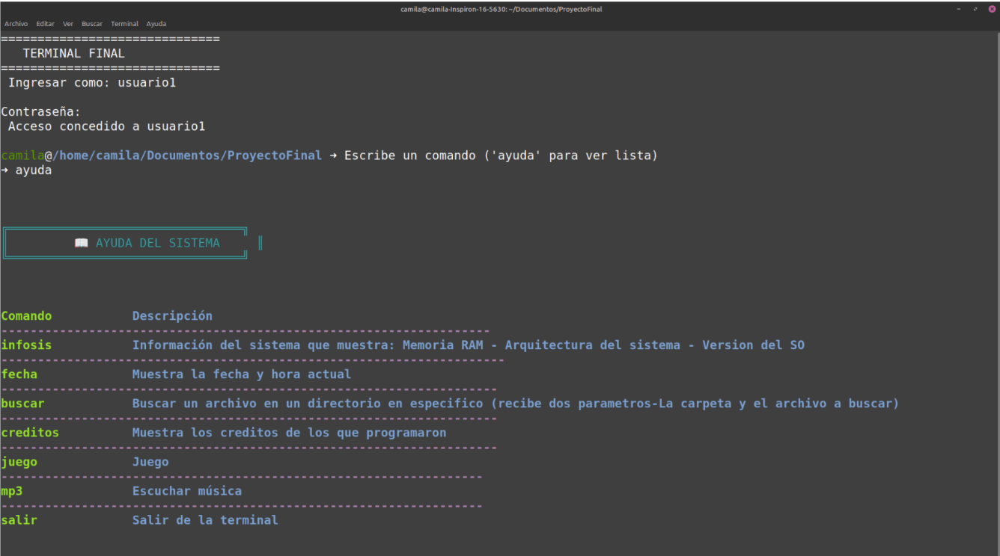

# 🖥️ Terminal

Una terminal interactiva desarrollada en Bash que permite al usuario acceder a diferentes funciones como consultar información del sistema, ver la fecha y hora actual, buscar archivos y más.

---

## 📌 Descripción breve

Este proyecto es una terminal personalizada escrita en Bash, sirve para automatizar funciones básicas del sistema. Se puede acceder a varias utilidades, como mostrar la información del sistema, consultar fecha y hora, buscar archivos.

---

## 🚧 Estado del proyecto

✅ Terminado - Funcional  

---

## 🖼️ Imágenes y capturas

### Menú principal:
Menú principal de la terminal y el comando ayuda


---

## 🛠️ Instalación

1. Clona este repositorio en tu sistema:
   ```bash
   git clone https://github.com/CamilaAlexandraSalas/TerminalLinux.git

---

## 📬 Créditos

Este proyecto fue desarrollado por:

- 👤 **Camila Salas**  
- 👤 **Valeria Pérez**  
- 🏫 Proyecto realizado para **PROTECSA**, en el curso de **GNU/Linux**.
